```text
  ███╗   ███╗ ██████╗ ████████╗██╗ ██████╗ ███╗   ██╗
  ████╗ ████║██╔═══██╗╚══██╔══╝██║██╔═══██╗████╗  ██║
  ██╔████╔██║██║   ██║   ██║   ██║██║   ██║██╔██╗ ██║
  ██║╚██╔╝██║██║   ██║   ██║   ██║██║   ██║██║╚██╗██║
  ██║ ╚═╝ ██║╚██████╔╝   ██║   ██║╚██████╔╝██║ ╚████║
  ╚═╝     ╚═╝ ╚═════╝    ╚═╝   ╚═╝ ╚═════╝ ╚═╝  ╚═══╝
  ██████╗ ███████╗███████╗██╗ ██████╗ ███╗   ██╗
  ██╔══██╗██╔════╝██╔════╝██║██╔════╝ ████╗  ██║
  ██║  ██║█████╗  ███████╗██║██║  ███╗██╔██╗ ██║
  ██║  ██║██╔══╝  ╚════██║██║██║   ██║██║╚██╗██║
  ██████╔╝███████╗███████║██║╚██████╔╝██║ ╚████║
  ╚═════╝ ╚══════╝╚══════╝╚═╝ ╚═════╝ ╚═╝  ╚═══╝

  GSAP Skills
  ──●────●────●────●────●────●──
  不是文档搬运。是让 agent 做出来的东西，不像 AI 做的。
```

[中文版 README_CN.md →](./README_CN.md)

# GSAP Motion Design Skills

> 用一套规则让 AI agent 停止产出千篇一律的 `Inter` + 紫色渐变 + `back.out(1.7)` + 居中 hero。
> **Three layers**: Design (taste) · State (timeline as data) · API (GSAP correctness).
> Plus 16 animation primitives and 20 templates — the agent-native **ChatCut**.

Community, third-party, agent-oriented GSAP motion skills. This repository is not published by GreenSock or Webflow.

Three layers: a **Design Layer** that teaches agents *taste* (brief inference, dials, recipes, anti-slop rules), a **State Layer** that keeps timelines as editable data, and an **API Layer** that teaches agents *correct GSAP implementation*. Design fires before code, State carries the edit loop, and API depth is loaded when code is written.

---

## 30-second quickstart

```bash
git clone https://github.com/taotao135791-bit/gsap-transform.git && cd gsap-transform
npm run verify                             # consistency gate
npm run pick product-hero-reveal            # clone template → projects/product-hero-reveal/
node scripts/state-to-scene.mjs projects/product-hero-reveal   # regenerate scene.js
cd projects/product-hero-reveal
npm install                                # install project render deps
node serve.mjs                              # browser preview w/ GSDevTools
node render.mjs --preset vertical --dry-run # 1080×1920 seek-loop smoke test
node render.mjs --preset vertical           # → output.mp4
```

The chatcut edit loop:

```bash
# edit projects/{slug}/state.json
# e.g. move a beat, change a duration, add a layer
node scripts/state-to-scene.mjs projects/{slug}
# refresh the browser tab — done
```

The agent does **not** edit `scene.js` by hand. It edits `state.json`. See [docs/SPEC.md](./docs/SPEC.md) for the full contract.

---

## Template gallery

20 ship in v1. Each is a folder under `templates/{slug}/` with `state.json` + `README.md`; gallery thumbnails live under `assets/motion-templates/`. Pick one with `npm run pick {slug}`.

| | | | | |
|---|---|---|---|---|
| 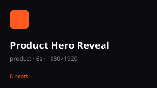 **Product Hero Reveal** — `product-hero-reveal` | 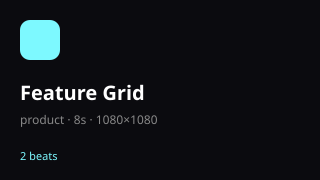 **Feature Grid** — `product-feature-grid` | 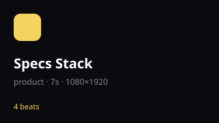 **Specs Stack** — `product-specs-stack` | 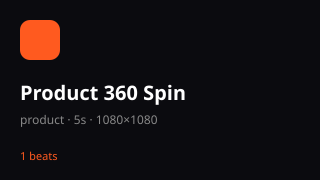 **360 Spin** — `product-360-spin` | 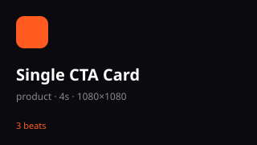 **CTA Card** — `product-cta-card` |
| 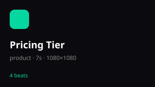 **Pricing Tier** — `product-pricing-tier` | 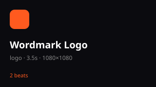 **Wordmark Logo** — `logo-wordmark` | 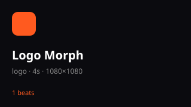 **Logo Morph** — `logo-morph` | 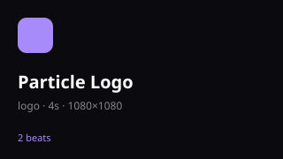 **Particle Logo** — `logo-particles` | 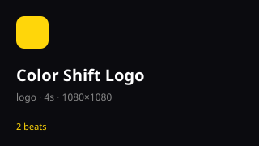 **Color Shift** — `logo-color-shift` |
| 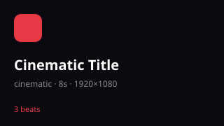 **Cinematic Title** — `cinematic-title` | 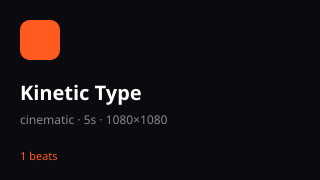 **Kinetic Type** — `kinetic-type-stagger` | 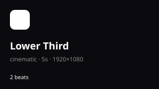 **Lower Third** — `lower-third` | 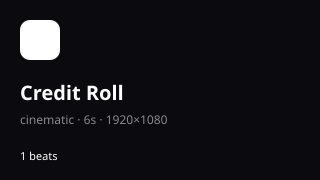 **Credit Roll** — `credit-roll` | 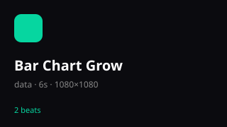 **Bar Chart** — `bar-chart-grow` |
| 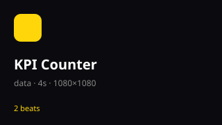 **KPI Counter** — `kpi-counter` | 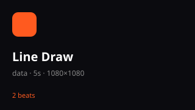 **Line Draw** — `line-draw` | 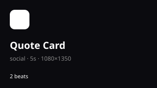 **Quote Card** — `quote-card` |  **Before/After** — `before-after` | 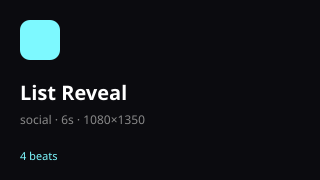 **List Reveal** — `list-reveal` |

Want a template that's not here? Open an issue — or write a `state.json` and contribute. Adding a template takes one file: see [`docs/SPEC.md` §4](./docs/SPEC.md).

---

## Why this exists

Every AI coding agent trained on the same SaaS templates. Ask for "an animated landing page" and you get:

- `Inter` for everything
- AI-purple gradients on a dark mesh
- centered hero with three equal cards below
- `back.out(1.7)` on every entrance
- parallax on every section, scrub on every block
- no `prefers-reduced-motion` branch

This is the slop pool. The GSAP API is powerful; the design direction given to the agent is not. **This skill set solves the direction problem.**

---

## The three-layer architecture

```
┌─────────────────────────────────────────────────────────────────┐
│  DESIGN LAYER (load FIRST — before any code)                    │
│                                                                 │
│  motion-design-taste   → brief inference, 3 dials, motion mode  │
│  motion-recipes        → 8 clone-able aesthetic × motion combos │
│  motion-anti-slop      → 32+ deterministic block/warn checks    │
│  motion-craft          → 11 commands (/init … /studio /export)  │
│  motion-studio         → preview project + render mp4/webm/mov  │
│  video-grammar         → shots, camera, transitions, beat-sync  │
└─────────────────────────────────────────────────────────────────┘
                          ↓ declares
┌─────────────────────────────────────────────────────────────────┐
│  STATE LAYER (NEW in v0.3) — the chatcut core                   │
│                                                                 │
│  motion-state          → state.json schema + runtime + window.  │
│                            __studio.state (query / add / remove)│
│  motion-primitives     → 16 verbs (fadeUp, splitReveal, ...)    │
│                                                                 │
│  20 templates/         → clone-able state.json + thumbnail.svg  │
└─────────────────────────────────────────────────────────────────┘
                          ↓ routes to
┌─────────────────────────────────────────────────────────────────┐
│  API LAYER (load AFTER — when writing GSAP code)                │
│                                                                 │
│  gsap-core · gsap-timeline · gsap-scrolltrigger · gsap-plugins  │
│  gsap-utils · gsap-react · gsap-frameworks · gsap-performance   │
└─────────────────────────────────────────────────────────────────┘
```

The Design Layer reads the user's brief, outputs a one-line **Design Read**, sets three dials (`MOTION_INTENSITY`, `DESIGN_VARIANCE`, `VISUAL_DENSITY`), picks a motion mode (Restrained / Expressive / Cinematic), and routes the agent to the right API skills. It also runs 32+ anti-slop checks before shipping.

---

## Workflow (the 5-step path agents actually follow)

```
1. motion-design-taste    "Reading this as: agency landing, cinematic mode, 8/8/3."
2. motion-recipes         Clone the Editorial Kinetic skeleton.
3. gsap-* API skills      Load gsap-scrolltrigger + gsap-plugins (SplitText).
4. motion-anti-slop       Walk A→G. Fix every block failure.
5. motion-craft /audit    Structured report. → /polish → /adapt.
```

No step is optional. Skipping step 1 is how slop happens.

---

## Installing

### npx skills (recommended)

```bash
npx skills add https://github.com/taotao135791-bit/gsap-transform
```

Works with any agent that supports the [Agent Skills format](https://agentskills.io). Deep adapters are shipped for the following agents (see table below).

### Adapter coverage

This repo ships dedicated configuration for each of these agents, in addition to the universal `skills/<name>/SKILL.md` format:

| Agent | Adapter file(s) | What you get |
|-------|----------------|--------------|
| **Claude Code** | `CLAUDE.md` (→ `AGENTS.md`), `.claude-plugin/{plugin,marketplace}.json` | Hard rules at session start + plugin marketplace install |
| **OpenAI Codex** | `AGENTS.md` | Hard rules at session start (Codex official standard) |
| **GitHub Copilot** | `.github/copilot-instructions.md` + `.github/instructions/<skill>.instructions.md` (16 path-scoped files) | Repo-wide hints + path-triggered per-skill rules |
| **Cursor** | `.cursor-plugin/{plugin,marketplace}.json` (remote) + `.cursor/rules/<skill>.mdc` (16 project-level rules with `globs:` frontmatter) | Marketplace install + auto-attached per-skill rules |
| **Google Gemini / Antigravity** | `GEMINI.md` (→ `AGENTS.md`) | Hard rules at session start |
| **Windsurf** | `.windsurf/rules/gsap.md` (current format) + `.windsurfrules` (legacy fallback) | Project-wide hard rules |

Any agent supporting the `skills/<name>/SKILL.md` format (OpenCode, Pi, Qoder, and most other Agent Skills clients) works via the universal Manual copy below.

### Claude Code

```
/plugin marketplace add taotao135791-bit/gsap-transform
```

### Cursor

Two install paths:
- **Remote rules market** — Settings → Rules → Add Rule → Remote Rule (Github) → `taotao135791-bit/gsap-transform`.
- **Project-level** — copy `.cursor/rules/` into your project; Cursor auto-attaches each skill when files matching its `globs` open.

### GitHub Copilot

Copy `.github/copilot-instructions.md` and the entire `.github/instructions/` directory into your project's `.github/`. Copilot reads them automatically.

### Windsurf

Copy `.windsurf/rules/gsap.md` into your project (current format). For older Windsurf versions, copy `.windsurfrules` to your project root instead.

### Manual copy (any Agent Skills-compatible agent)

| Agent | Skill Directory |
|-------|-----------------|
| Claude Code | `~/.claude/skills/` |
| Cursor | `~/.cursor/skills/` |
| OpenCode | `~/.config/opencode/skills/` |
| OpenAI Codex | `~/.codex/skills/` |
| Google Antigravity | `~/.gemini/antigravity/skills/` |
| Pi | `~/.pi/agent/skills/` |
| Qoder | `~/.qoder/skills/` |

---

## Skills index — from the user's problem, not the SKILL name

### "I need aesthetic direction before coding"

| Load | What it does |
|------|-------------|
| **motion-design-taste** | Brief inference → Design Read → 3 dials → motion mode → routes to API skills |
| **motion-recipes** | 8 ready-to-clone pairings: Editorial Kinetic / Brutalist Scroll / Liquid Glass Hover / Bento Flip / Minimal Fade / Cinematic Pinned Scrub / Kinetic Type Stagger / Grid Break Overlap |
| **motion-anti-slop** | 32+ deterministic anti-slop rules in 7 groups (A→G). Each has a detect signature, wrong snippet, fix snippet, and block/warn severity |
| **motion-craft** | 11 commands: `/init` `/shape` `/animate` `/polish` `/audit` `/critique` `/quieter` `/bolder` `/adapt` `/studio` `/export` |
| **motion-studio** | preview-project template + `render.mjs` (mp4/webm/mov · 1080p/4k/vertical/square) + `serve.mjs` timeline preview. `/studio` produces a self-contained folder you scrub + render |
| **video-grammar** | shots / virtual camera (`.camera` push/pull/pan) / transitions / BPM beat-sync / aspect safe areas. Loads with motion-design-taste when the output is a rendered video |

### "I need correct GSAP implementation"

| Load | Covers |
|------|--------|
| **gsap-core** | `to` / `from` / `fromTo` / `set`, easing, stagger, `matchMedia`, transform aliases, `autoAlpha` |
| **gsap-timeline** | sequencing, position parameter, labels, nesting |
| **gsap-scrolltrigger** | pin, scrub, batch, refresh, containerAnimation, scrollerProxy |
| **gsap-plugins** | SplitText, MorphSVG, DrawSVG, MotionPath, Flip, Draggable, Inertia, Observer, CustomEase, ScrambleText, Physics2D, and more |
| **gsap-utils** | clamp, mapRange, interpolate, distribute, snap, wrap, toArray, pipe |
| **gsap-react** | `useGSAP` hook, scope, contextSafe, SSR |
| **gsap-frameworks** | Vue, Nuxt, Svelte lifecycle + cleanup |
| **gsap-performance** | `quickTo`, transform-only, `will-change`, batch vs loop |

---

## What the Design Layer actually prevents (examples)

| Without this skill set | With it |
|---|---|
| `ease: "back.out(1.7)"` on every entrance | Reserved for one branded moment; default `expo.out` / `power3.out` per motion mode band |
| `Inter` + slate-900 everywhere | Design Read picks a font pool; `Inter` is only allowed when the brief says "Linear-style" |
| Purple gradient hero with glowing radial | Accent is inferred from the brief; palette alternatives enforced when default-reaching for beige+brass or AI-purple |
| No `prefers-reduced-motion` | Every project wrapped in `gsap.matchMedia()`; shipping without it is a Pre-Flight Failure |
| `parallax` on every section | Parallax earns one or two sections; the rest hold still (Anti-Slop C4) |
| Hover `y: -8` + `scale: 1.05` + heavier shadow | Pick one signal — lift OR scale OR shadow (Anti-Slop C3) |
| `cdn.jsdelivr.net/npm/gsap/<Plugin>.js` for browser ESM | `esm.sh` with default import for every plugin (Anti-Slop G3 + G4) |

---

## Structure

```
gsap-transform/
  README.md / README_CN.md
  AGENTS.md
  docs/SPEC.md                # binding dev spec + acceptance criteria
  skills/
    # Design Layer
    motion-design-taste/  SKILL.md
    motion-recipes/       SKILL.md
    motion-anti-slop/     SKILL.md
    motion-craft/         SKILL.md
    # State Layer (v0.3)
    motion-state/         SKILL.md  schema.json  runtime.mjs
    motion-primitives/    SKILL.md  *.js × 16
    # API Layer
    gsap-core/            SKILL.md
    gsap-timeline/        SKILL.md
    gsap-scrolltrigger/   SKILL.md
    gsap-plugins/         SKILL.md
    gsap-utils/           SKILL.md
    gsap-react/           SKILL.md
    gsap-performance/     SKILL.md
    gsap-frameworks/      SKILL.md
    # Delivery
    motion-studio/        SKILL.md  templates/{index.html,scene.js,render.mjs,…}
    video-grammar/        SKILL.md
  templates/                # 20 clone-able state.json + README + thumbnail
  assets/motion-templates/  # SVG thumbnails
  examples/
    vanilla/ react/ vue/ nuxt/
    showcase/{editorial-kinetic,brutalist-scroll,liquid-glass-hover}
    studio/{cinematic-title,cookware-promo,helix-launch}      # hand-written
    studio-state/product-hero-reveal/                        # state-driven
  tests/                    # node:test, 73 assertions
    motion-primitives/  motion-state/  templates/  render/
  scripts/                  # verify-consistency / gen-templates / state-to-scene / pick-template
  projects/                 # local working dirs (gitignored)
```

---

## GSAP is free

> Every plugin — SplitText, MorphSVG, DrawSVG, Flip, Draggable, all of them — is **100% free** since Webflow's acquisition of GSAP. Install from the public `gsap` npm package. No `.npmrc`, no auth token, no Club membership.

---

## License

MIT
